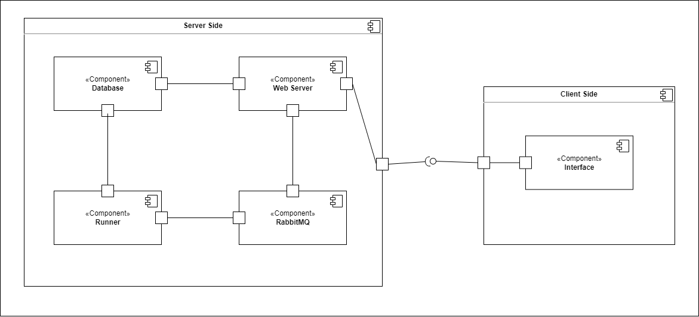
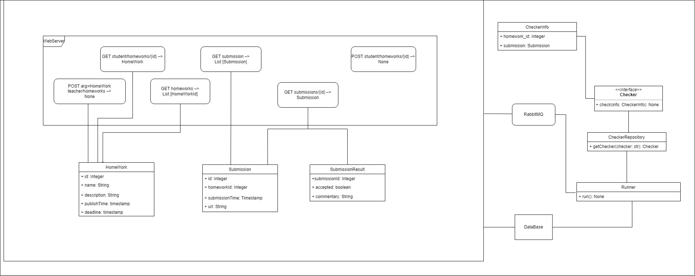

# MyHwProj
## Разработчики
- Чайкова Анастасия
- Эгипти Павел
- Шелухина Екатерина
- Габитов Даниил

## Общие сведения о системе

Система для проверки домашних заданий студентов.
### Границы системы
- Работа с одним студентом
- Работа с одним преподавателем
- Доступ только к одному предмету
- Веб-приложение
- Взаимодействие с помощью HTTP запросов

### Технические ограничения
- Приложение должно поддерживаться на MacOS, Linux и Windows

## Ключевые требования
- Проверкой должно заниматься не веб-приложение, а раннер, работающий как отдельное приложение и связанный с веб-частью
- Раннеров может быть много, очередь должна балансировать между ними нагрузку
- Возможность легко и просто добавить новый алгоритм проверки домашней работы
- Удобный Web-Api

### Бизнес-ограничения
- Время, выделенное на разработку системы - 1 неделя
- Использование open-source библиотек

### Решения, принятые в ходе проектирования
- Использование RabbitMQ в качестве очереди сообщений.     
- Использование PostgeSQL в качестве СУБД.
- Использование FastAPI в качестве веб-фреймворка. 
- Причины: 
  - Успешно выполняют поставленные задачи.
  - Командой было принято решение использовать технологии, с которыми у каждого члена команды был опыт работы, в связи с ограничением времени на разработку системы. 

### Качественные характеристики системы
- Изменяемая система: возможность добавления новой функциональности

### Функциональные требования

- Студент может:
  - Просматривать список домашних работ, отсортированный по близости дедлайна, причём
  должны показываться только работы, дата публикации которых уже наступила
  - Сдавать решение в виде ссылки на GitHub — для этого ему надо кликнуть на элемент
  списка домашних работ, в результате чего он попадёт на экран с детальной информацией
  о работе (включая полное условие), полем для ввода ссылки на решение и кнопкой
  «Submit»
  - Просмотреть список результатов, отсортированный по дате сдачи
  - Просмотреть детальную информацию о попытке по клику на элемент списка результатов,
  включая текстовый вывод программы-проверялки

- Преподаватель может:
  - Добавить новую домашнюю работу;
  - Просмотреть список результатов, отсортированный по дате сдачи;
  - Просмотреть детальную информацию о попытке по клику на элемент списка результатов,
  включая текстовый вывод программы-проверялки;

## Роли и случаи использования

Роли:
- Студент
- Преподаватель

Случаи использования:
- Студент хочет узнать, когда ближайший дедлайн и в зависимости от этого отправить задание
- Преподаватель хочет посмотреть на сданные задания студента и поставить оценку

### Описание типичного пользователя

**Имя:** Данил

**Возраст:** 20 лет

Данил очень много времени тратит на игрушки, его любимая - [рогалик](https://github.com/eshelukhina/HSE2022-RogueLike).
Из-за страсти к игрушкам ему бывает сложно уследить за всеми дедлайнами. Поэтому он хочет иметь приложение, показывающее ему домашние работы, за которые необходимо браться в первую очередь.

## Композиция 

Описание компонент:
* `Web Server` - точка входа для запросов пользователей
* `Database` - база данных, где лежат все домашние задания, посылки с их результатами
* `Runner` - проверяет посылки, и результаты складывает в базу данных
* `RabbitMQ` - очередь из запросов на проверку домашних работ, а также из результатов проверки

## Логическая структура

Список классов:
* `WebServer` - класс, ответственный за обработку запросов
* `HomeWork` - домашняя работа
* `Submission` - попытка сдачи домашней работы
* `SubmissionResult` - результат проверки домашней работы
* `Runner` - проверяет посылки, складывает результат в очередь
* `Checker` - интерфейс для проверялок
* `CheckerInfo` - данные о домашней работе и посылки, необходимые для проверялки
* `CheckerRepository` - хранит все существующие проверялки
* `Database` - база данных

### Как добавить новую проверялку
Для добавления новой проверялки необходимо отнаследоваться от интерфейса `Checker`, реализовать метод `check(info: CheckerInfo)`, добавить экземпляр класса в словарь `checker_dict` (в качестве ключа выбрать какое-то название для проверялки).
В дальнейшем при добавлении нового домашнего задания необходимо в поле `Алгоритм тестирования` вставить название проверялки. Потом ещё надо пересобрать docker-образ и всё перезапустить.